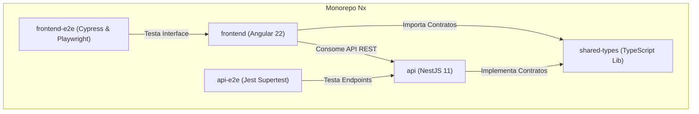
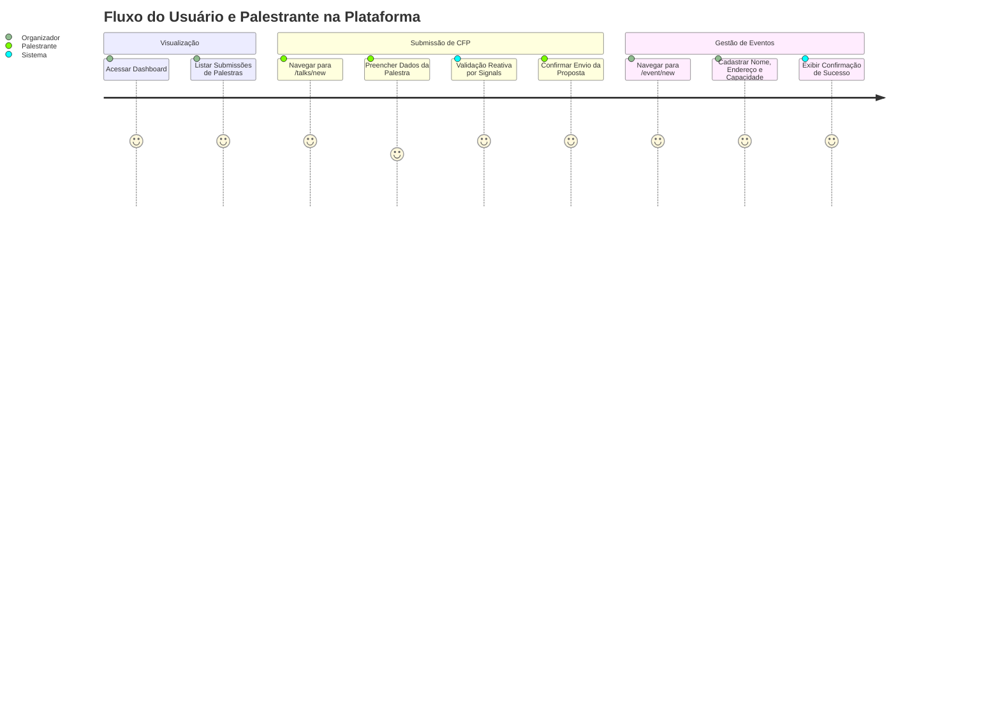

# 🚀 CFP Platform — Call for Papers & Event Management

> **Projeto Desenvolvido na Pós-Graduação em Engenharia de Software e IA Aplicada — UNIPDS**  
> **Disciplina:** Ferramentas de IA para UX e UI (`D05_Ferramentas_UI_UX`)

[](https://nx.dev)
[](https://angular.dev)
[](https://nestjs.com)
[](https://www.typescriptlang.org/)
[](https://www.cypress.io/)
[](https://playwright.dev/)
[](#-metodologias--práticas-inovadoras)

---

## 📌 Sumário
1. [Sobre o Projeto](#-sobre-o-projeto)
2. [Motivação Acadêmica & Objetivos](#-motivação-acadêmica--objetivos)
3. [Metodologias & Práticas Inovadoras](#-metodologias--práticas-inovadoras)
   - [Spec-Driven Development (SDD) com OpenSpec](#-1-spec-driven-development-sdd-com-openspec)
   - [Desenvolvimento Multi-Agente Paralelo com Git Worktrees](#-2-desenvolvimento-multi-agente-paralelo-com-git-worktrees)
   - [Testes E2E Tradicionais e AI-Driven Testing](#-3-testes-e2e-tradicionais-e-ai-driven-testing)
4. [Arquitetura do Monorepo](#-arquitetura-do-monorepo)
5. [Funcionalidades da Aplicação](#-funcionalidades-da-aplicação)
6. [Preview Visual & Diagramas de Fluxo](#-preview-visual--diagramas-de-fluxo)
7. [Tecnologias Utilizadas](#-tecnologias-utilizadas)
8. [Como Executar o Projeto](#-como-executar-o-projeto)
9. [Suíte de Testes & Qualidade](#-suíte-de-testes--qualidade)
10. [Estrutura de Diretórios](#-estrutura-de-diretórios)

---

## 📖 Sobre o Projeto

A **CFP Platform** é uma solução completa para gerenciamento de **Call for Papers (CFP)** e **Cadastro de Eventos Tecnológicos**. A plataforma permite que palestrantes submetam propostas de conteúdo com validação reativa e acessibilidade em tempo real, organizadores avaliem as submissões em um dashboard centralizado, e gestores realizem o cadastro de novos eventos.

O ecossistema foi construído sobre uma arquitetura moderna de **Monorepo Nx**, integrando **Angular 22** (com Standalone Components e Signals) no frontend, **NestJS 11** no backend e uma biblioteca compartilhada de tipos em **TypeScript** (`shared-types`).

---

## 🎓 Motivação Acadêmica & Objetivos

Este projeto foi concebido e desenvolvido no âmbito da disciplina **Ferramentas de IA para UX e UI** (`D05_Ferramentas_UI_UX`), pertencente ao programa de **Pós-Graduação em Engenharia de Software e IA Aplicada** da **UNIPDS**.

### Principais Objetivos Alcançados:
- **IA no Ciclo de Vida do Software**: Aplicar agentes de IA não apenas na geração pontual de código, mas no planejamento de engenharia, especificação comportamental, desenvolvimento paralelo em backend/frontend e autoria de testes automatizados.
- **UX/UI Orientado a Especificações (Spec-Driven UX)**: Garantir que princípios de acessibilidade (WAI-ARIA), validação dinâmica e consistência visual fossem definidos formalmente em contratos de especificações antes da escrita do código.
- **Orquestração de Agentes Autônomos**: Experimentar novos ecossistemas de desenvolvimento onde múltiplos agentes de IA atuam colaborativamente em repositórios desacoplados.

---

## 🛠 Metodologias & Práticas Inovadoras

### 📋 1. Spec-Driven Development (SDD) com OpenSpec
Adotamos a metodologia **Spec-Driven Development** (SDD) utilizando a ferramenta e convenção **OpenSpec** (`openspec` / workflow `opsx`). O desenvolvimento seguiu um fluxo estrito onde nenhuma linha de código foi produzida sem uma especificação prévia:

1. **Especificação Comportamental**: Requisitos descritos em cenários Gherkin-like (`GIVEN/WHEN/THEN`).
2. **Contratos DTO & Interfaces**: Definição antecipada das estruturas de dados compartilhadas (`SpeakerDTO`, `EventDTO`).
3. **Requisitos de Acessibilidade (WAI-ARIA)**: Inclusão formal de atributos como `aria-required`, `aria-invalid` e `aria-describedby` na especificação dos componentes.
4. **Execução Autônoma**: Agentes de IA leram os artefatos em `openspec/specs/` (`cfp-submission`, `cfp-dashboard`, `event-registration`) como fonte única da verdade para gerar os testes e a implementação.

### 🤖 2. Desenvolvimento Multi-Agente Paralelo com Git Worktrees
Para acelerar a entrega e validar a engenharia de software baseada em IA paralela, aplicamos a estratégia de **Multi-Agent Orchestration com Git Worktrees**:

- **Worktree Backend (`api`)**: Agente especialista dedicado à implementação de endpoints NestJS, serviços, controllers, DTOs e validações com `class-validator`.
- **Worktree Frontend (`frontend`)**: Agente especialista focado na construção de componentes Angular 22, gerenciamento de estado reativo via **Angular Writable Signals** e consumo dos endpoints REST.
- **Isolamento e Integração Limpa**: O uso de Git Worktrees permitiu que cada agente trabalhasse em instâncias isoladas do repositório, compartilhando o pacote de tipos (`shared-types`), eliminando conflitos de merge e permitindo integrações fluidas na branch principal.

### 🧪 3. Testes E2E Tradicionais e AI-Driven Testing
A garantia de qualidade da aplicação abrange múltiplos níveis de testes:

1. **Testes E2E Determinísticos (Cypress)**: Suíte em `frontend-e2e/src/e2e/event-registration.cy.ts` testando o preenchimento de formulários, validação de campos obrigatórios e estado de conclusão.
2. **AI-Driven Testing (Cypress + LLM Prompts)**: Implementação de testes guiados por intenção semântica utilizando o comando `cy.prompt()` em `frontend-e2e/src/e2e/event-registration-ai.cy.ts`.
3. **Integração Playwright**: Configuração para execução e auditoria de navegação visual via Playwright MCP (`playwright.config.mts`).

---

## 📐 Arquitetura do Monorepo



### Componentes e Responsabilidades

| Projeto | Tecnologia | Responsabilidade |
| :--- | :--- | :--- |
| **`frontend`** | Angular 22, Signals, RxJS | Interfaces de usuário reativas (Dashboard, Submissão de CFP, Cadastro de Eventos). |
| **`api`** | NestJS 11, TypeScript | API RESTful com rotas `/api/cfp` e `/api/event`, geração automática de UUIDs e DTO ValidationPipes. |
| **`shared-types`** | TypeScript Library | Biblioteca interna com definições de contratos (`SpeakerDTO`, `EventDTO`). |
| **`frontend-e2e`** | Cypress & Playwright | Suíte de testes de ponta a ponta com suporte a validação tradicional e AI-driven. |
| **`api-e2e`** | Jest & Supertest | Suíte de testes de integração e validação de contratos de API. |

---

## ⚡ Funcionalidades da Aplicação

### 🎤 1. Submissão de CFP (`/talks/new`)
- Form para submissão de propostas por palestrantes (`Nome`, `Email`, `Título da Palestra`, `GDE Status`).
- Reatividade total via **Angular Signals** (`WritableSignal`).
- Botão de envio habilitado dinamicamente mediante validação de formulário.
- Conformidade com padrões WAI-ARIA para leitores de tela.

### 📊 2. Dashboard de Submissões (`/dashboard`)
- Painel para organizadores consultarem todas as palestras submetidas.
- Integração via `GET /api/cfp`.
- Design responsivo e alinhado aos tokens visuais da aplicação.

### 📅 3. Cadastro de Eventos (`/event/new`)
- Registro completo de eventos (`Nome`, `Endereço`, `Capacidade`, `Data`).
- Mensagens de feedback reativo (`alert-success`) ao concluir o cadastro.
- Validação em tempo real de campos nulos/inválidos.

---

## 🖼 Preview Visual & Diagramas de Fluxo

### 🗺 Jornada de Interação do Usuário



### 📱 Mapa de Rotas e Telas

```
┌─────────────────────────────────────────────────────────────────────────┐
│                          CFP Platform Routes                            │
├────────────────────┬──────────────────────┬─────────────────────────────┤
│    /dashboard      │      /talks/new      │         /event/new          │
│  (Dashboard CFP)   │ (Submissão Palestra) │    (Cadastro de Evento)     │
└────────────────────┴──────────────────────┴─────────────────────────────┘
```

---

## 🛠 Tecnologias Utilizadas

### Core & Frameworks
- **[Nx Monorepo](https://nx.dev)** (v23.1): Gerenciamento do monorepo, tarefas inteligentes e cache de builds.
- **[Angular](https://angular.dev)** (v22.0): Framework web moderno com Standalone Components e Signals.
- **[NestJS](https://nestjs.com)** (v11.0): Framework backend em Node.js com arquitetura modular.
- **[TypeScript](https://www.typescriptlang.org)** (v6.0): Tipagem estática fim a fim.

### Validação, Testes & SDD
- **[class-validator](https://github.com/typestack/class-validator)** & **[class-transformer](https://github.com/typestack/class-transformer)**: Validação e transformação de DTOs HTTP.
- **[Cypress](https://www.cypress.io)** (v15.17): Testes E2E interativos e AI-driven testing (`cy.prompt`).
- **[Playwright](https://playwright.dev)**: Framework de automação E2E e suporte a ferramentas MCP.
- **[Jest](https://jestjs.io)** & **[Vitest](https://vitest.dev)**: Suítes de testes unitários.
- **[OpenSpec](https://github.com)**: Especificação formal Spec-Driven Development.

---

## 🚀 Como Executar o Projeto

### Pré-requisitos
- **Node.js**: `v20.x` ou superior (definido no `.nvmrc`)
- **npm**: `v10.x` ou superior

### 1. Clonar o Repositório e Instalar Dependências
```bash
git clone https://github.com/ThauanyAA/cfp-platform.git
cd cfp-platform
npm install
```

### 2. Executar a Aplicação em Modo de Desenvolvimento

É possível iniciar o backend e o frontend simultaneamente utilizando o Nx:

#### Opção A: Execução Simultânea (Recomendado)
```bash
npx nx run-many -t serve
```

#### Opção B: Execução Individual de Serviços
- **Servidor Backend (NestJS API)**:
  ```bash
  npx nx serve api
  ```
  *Servidor executando em: `http://localhost:3000/api`*

- **Servidor Frontend (Angular App)**:
  ```bash
  npx nx serve frontend
  ```
  *Aplicação web acessível em: `http://localhost:4200`*

---

## 🧪 Suíte de Testes & Qualidade

### Testes Unitários
```bash
# Testes do Backend (NestJS)
npx nx test api

# Testes do Frontend (Angular)
npx nx test frontend
```

### Testes End-to-End (E2E)
```bash
# Execução da suíte Cypress em headless mode
npx nx e2e frontend-e2e

# Execução interativa com interface do Cypress
npx nx e2e frontend-e2e --watch
```

---

## 📁 Estrutura de Diretórios

```
cfp-platform/
├── .agent/               # Workflows e skills de agentes autônomos de IA
├── openspec/             # Especificações Spec-Driven Development (OpenSpec)
│   ├── specs/            # Specs ativas (cfp-dashboard, cfp-submission, event-registration)
│   └── changes/          # Artefatos de mudanças e deltas arquivados
├── api/                  # Aplicação Backend NestJS
│   └── src/app/          # Controllers, Services e DTOs da API REST
├── frontend/             # Aplicação Frontend Angular 22
│   └── src/app/          # Standalone Components (cfp-form, cfp-dashboard, event-form)
├── shared-types/         # Biblioteca TypeScript compartilhada (SpeakerDTO, EventDTO)
├── frontend-e2e/         # Suítes de Testes E2E (Cypress & Playwright)
├── api-e2e/              # Suítes de Testes de Integração de API (Jest Supertest)
├── nx.json               # Configurações globais do Nx Monorepo
└── package.json          # Gerenciamento de dependências
```

---

## 🎓 Créditos & Autoria

Projeto desenvolvido por **Thauany Alves** como trabalho prático para a disciplina **Ferramentas de IA para UX e UI** (`D05_Ferramentas_UI_UX`), sob orientação acadêmica na **Pós-Graduação em Engenharia de Software e IA Aplicada** da **UNIPDS**.

---

<p align="center">
  <i>Construído com 🧠 Spec-Driven Development, 🤖 Agentes de IA em Parallel Worktrees e ⚡ Monorepo Nx.</i>
</p>
